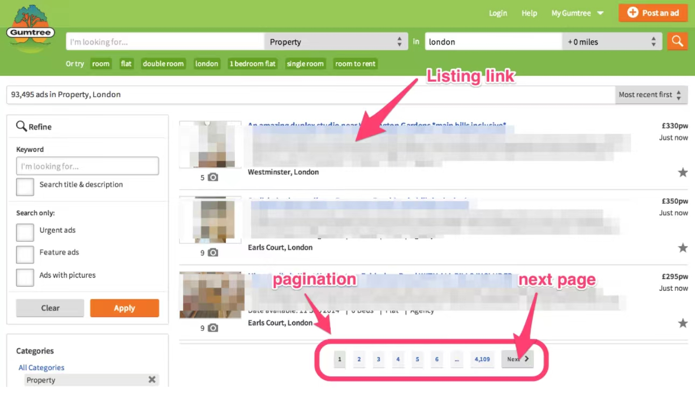

# Scrapy基本抓取流程UR²IM

一切始于URL，发起Request，由Response检索抽取需要的数据（可能包含更多URL），将数据填充于Item中，方便pipelines对Item进行二次加工（校验、清洗、存储等）。由Response获取更多URL，继续对URL发起抓取流程。


<!-- more -->

# Scrapy项目基本步骤

## 安装 Scrapy
`pip`安装：

```
$ python -m pip install Scrapy
```

`conda`安装：

```
$ conda install -c conda-forge scrapy
```

## [创建项目](https://docs.scrapy.org/en/latest/intro/tutorial.html#creating-a-project)

```
$ scrapy startproject [项目名]
```

以项目名为`tutorial`为例，新创建的项目目录包含以下内容：

```
tutorial/
    scrapy.cfg            # deploy configuration file

    tutorial/             # project's Python module, you'll import your code from here
        __init__.py

        items.py          # project items definition file

        middlewares.py    # project middlewares file

        pipelines.py      # project pipelines file

        settings.py       # project settings file

        spiders/          # a directory where you'll later put your spiders
            __init__.py
            spider.py     # 爬虫文件，用户在其中定义Spider类的子类，Scrapy据此来进行web爬取
```

## 创建spider文件

项目目录中的`spiders`目录用以存放spiders文件。Scrapy提供了命令行工具，可根据指定模板自动生成spider文件：

```
$ scrapy.exe genspider -h
Usage
=====
  scrapy genspider [options] <name> <domain>

Generate new spider using pre-defined templates

Options
=======
  -h, --help            show this help message and exit
  -l, --list            List available templates
  -e, --edit            Edit spider after creating it
  -d TEMPLATE, --dump TEMPLATE
                        Dump template to standard output
  -t TEMPLATE, --template TEMPLATE
                        Uses a custom template.
  --force               If the spider already exists, overwrite it with the template

Global Options
--------------
  --logfile FILE        log file. if omitted stderr will be used
  -L LEVEL, --loglevel LEVEL
                        log level (default: DEBUG)
  --nolog               disable logging completely
  --profile FILE        write python cProfile stats to FILE
  --pidfile FILE        write process ID to FILE
  -s NAME=VALUE, --set NAME=VALUE
                        set/override setting (may be repeated)
  --pdb                 enable pdb on failure
```

如果不指定模板，则默认为`basic`，查看可用的模板：

```
$ scrapy genspider -l
Available templates:
  basic
  crawl
  csvfeed
  xmlfeed
```

基于`basic`模板（默认）创建spider文件：

```bash
scrapy.exe genspider -t basic myspider example.com
```

基于`crawl`模板创建spider文件：

```
scrapy.exe genspider -t crawl myspider example.com
```

## [定义Spider类](https://docs.scrapy.org/en/latest/intro/tutorial.html#our-first-spider)

创建完spider文件，用户必须在spider文件中创建 [`Spider`](https://docs.scrapy.org/en/latest/topics/spiders.html#scrapy.Spider)类的子类，并在其中定义初始的请求，同时定义如何解析响应并从中抽取数据。Scrapy 会根据用户自定义的`Spider`类来进行Web爬取。

```python
// quotes_spider.py

from pathlib import Path

import scrapy


class QuotesSpider(scrapy.Spider):
    # name属性用以识别Spider。同一项目中，不同Spider的name必须唯一。
    name = "quotes"

    # 如果初始URL是静态的，则可以使用start_url属性替换start_requests方法。
    # start_urls = ('https://www.example.com/index.html',)
    # start_urls = ['https://www.example.com/index.html']
    
    # 如果需要动态生成初始URL，则需定义start_requests方法。
    def start_requests(self):
        urls = [
            "https://quotes.toscrape.com/page/1/",
            "https://quotes.toscrape.com/page/2/",
        ]
        for url in urls:
            yield scrapy.Request(url=url, callback=self.parse)

    def parse(self, response):
        page = response.url.split("/")[-2]
        filename = f"quotes-{page}.html"
        Path(filename).write_bytes(response.body)
        self.log(f"Saved file {filename}")
```

[`scrapy.Spider`](https://docs.scrapy.org/en/latest/topics/spiders.html#scrapy.Spider)的子类包含如下属性和方法：

- [`name`](https://docs.scrapy.org/en/latest/topics/spiders.html#scrapy.Spider.name): name属性用以识别Spider。同一项目中，不同Spider的name必须唯一。

- [`start_requests()`](https://docs.scrapy.org/en/latest/topics/spiders.html#scrapy.Spider.start_requests): must return an iterable of Requests (you can return a list of requests or write a generator function) which the Spider will begin to crawl from. Subsequent requests will be generated successively from these initial requests. 如果需要动态生成初始URL，则需定义`start_requests`方法。

- [`start_urls`](https://docs.scrapy.org/en/latest/intro/tutorial.html#a-shortcut-to-the-start-requests-method)包含初始URL字符串的序列（tuple或list）。如果初始URL是静态的，则可以使用`start_url`属性替换`start_requests`方法。

- [`parse()`](https://docs.scrapy.org/en/latest/topics/spiders.html#scrapy.Spider.parse): a method that will be called to handle the response downloaded for each of the requests made. The response parameter is an instance of [`TextResponse`](https://docs.scrapy.org/en/latest/topics/request-response.html#scrapy.http.TextResponse) that holds the page content and has further helpful methods to handle it.

  The [`parse()`](https://docs.scrapy.org/en/latest/topics/spiders.html#scrapy.Spider.parse) method usually parses the response, extracting the scraped data as dicts and also finding new URLs to follow and creating new requests (`Request`) from them.

## [运行spider](https://docs.scrapy.org/en/latest/intro/tutorial.html#how-to-run-our-spider)

### `scrapy shell` —— 在交互式shell中编写代码

```
$ scrapy shell -h
Usage
=====
  scrapy shell [url|file]

Interactive console for scraping the given url or file. Use ./file.html syntax or full path for local file.

Options
=======
  -h, --help            show this help message and exit
  -c CODE               evaluate the code in the shell, print the result and exit
  --spider SPIDER       use this spider
  --no-redirect         do not handle HTTP 3xx status codes and print response as-is


```

### `scrapy parse` ——验证Spider `parse`方法的结果

```
$ scrapy parse -h
Usage
=====
  scrapy parse [options] <url>

Parse URL (using its spider) and print the results

Options
=======
  -h, --help            show this help message and exit
  -a NAME=VALUE         set spider argument (may be repeated)
  -o FILE, --output FILE
                        append scraped items to the end of FILE (use - for stdout), to define format set a colon at the end of the output URI (i.e. -o FILE:FORMAT)    
  -O FILE, --overwrite-output FILE
                        dump scraped items into FILE, overwriting any existing file, to define format set a colon at the end of the output URI (i.e. -O FILE:FORMAT)   
  -t FORMAT, --output-format FORMAT
                        format to use for dumping items
  --spider SPIDER       use this spider without looking for one
  --pipelines           process items through pipelines
  --nolinks             don't show links to follow (extracted requests)
  --noitems             don't show scraped items
  --nocolour            avoid using pygments to colorize the output
  -r, --rules           use CrawlSpider rules to discover the callback
  -c CALLBACK, --callback CALLBACK
                        use this callback for parsing, instead looking for a callback
  -m META, --meta META  inject extra meta into the Request, it must be a valid raw json string
  --cbkwargs CBKWARGS   inject extra callback kwargs into the Request, it must be a valid raw json string
  -d DEPTH, --depth DEPTH
                        maximum depth for parsing requests [default: 1]
  -v, --verbose         print each depth level one by one
```


### `scrapy runspider` ——运行给定spider文件中定义的Spider

```
$ scrapy runspider -h
Usage
=====
  scrapy runspider [options] <spider_file>

Run the spider defined in the given file

Options
=======
  -h, --help            show this help message and exit
  -o FILE, --output FILE
                        append scraped items to the end of FILE (use - for stdout), to define format set a colon at the end of the output URI (i.e. -o FILE:FORMAT)    
  -O FILE, --overwrite-output FILE
                        dump scraped items into FILE, overwriting any existing file, to define format set a colon at the end of the output URI (i.e. -O FILE:FORMAT)   
  -t FORMAT, --output-format FORMAT
                        format to use for dumping items
```

### `scrapy crawl` ——运行特定name的Spider

```
$ scrapy crawl -h    
Usage
=====
  scrapy crawl [options] <spider>

Run a spider

Options
=======
  -h, --help            show this help message and exit
  -a NAME=VALUE         set spider argument (may be repeated)
  -o FILE, --output FILE
                        append scraped items to the end of FILE (use - for stdout), to define format set a colon at the end of the output URI (i.e. -o FILE:FORMAT)    
  -O FILE, --overwrite-output FILE
                        dump scraped items into FILE, overwriting any existing file, to define format set a colon at the end of the output URI (i.e. -O FILE:FORMAT)   
  -t FORMAT, --output-format FORMAT
                        format to use for dumping items
```

在项目顶级目录执行命令来运行Spider：

```
scrapy crawl quotes
```

此命令运行name为 `quotes` 的Spider，得到以下输出:

```
... (omitted for brevity)
2016-12-16 21:24:05 [scrapy.core.engine] INFO: Spider opened
2016-12-16 21:24:05 [scrapy.extensions.logstats] INFO: Crawled 0 pages (at 0 pages/min), scraped 0 items (at 0 items/min)
2016-12-16 21:24:05 [scrapy.extensions.telnet] DEBUG: Telnet console listening on 127.0.0.1:6023
2016-12-16 21:24:05 [scrapy.core.engine] DEBUG: Crawled (404) <GET https://quotes.toscrape.com/robots.txt> (referer: None)
2016-12-16 21:24:05 [scrapy.core.engine] DEBUG: Crawled (200) <GET https://quotes.toscrape.com/page/1/> (referer: None)
2016-12-16 21:24:05 [scrapy.core.engine] DEBUG: Crawled (200) <GET https://quotes.toscrape.com/page/2/> (referer: None)
2016-12-16 21:24:05 [quotes] DEBUG: Saved file quotes-1.html
2016-12-16 21:24:05 [quotes] DEBUG: Saved file quotes-2.html
2016-12-16 21:24:05 [scrapy.core.engine] INFO: Closing spider (finished)
```

## 创建Item

Web爬取的主要目的是从非结构化的数据源（如，网页）中抽取结构化的数据。Item是以键值对形式定义的Python对象。spiders返回抽取后的数据作为item。

在项目目录的`items.py`中创建Item并定义字段。

借助 [itemadapter](https://github.com/scrapy/itemadapter) 库，Scrapy支持以下多种类型作为item: [字典](https://docs.scrapy.org/en/latest/topics/items.html#dict-items), [Item 对象](https://docs.scrapy.org/en/latest/topics/items.html#item-objects), [dataclass 对象](https://docs.scrapy.org/en/latest/topics/items.html#dataclass-items), and [attrs 对象](https://docs.scrapy.org/en/latest/topics/items.html#attrs-items).

- **`Item`对象**

定义 `Item` 类的子类、定义Item字段：

```python
from scrapy.item import Item, Field

class CustomItem(Item):
    one_field = Field()
    another_field = Field()
```

- **dataclass 对象**

```python
from dataclasses import dataclass

@dataclass
class CustomItem:
    one_field: str
    another_field: int
```

- **`attr.s` 对象**

```python
import attr

@attr.s
class CustomItem:
    one_field = attr.ib()
    another_field = attr.ib()
```

## 使用`Item`对象

在项目目录的`items.py`中创建`Item`类的子类并定义字段：

```python
import scrapy


class ProductItem(scrapy.Item):
    name = scrapy.Field()
    price = scrapy.Field()
    stock = scrapy.Field()
    tags = scrapy.Field()
    last_updated = scrapy.Field(serializer=str)
```

然后在`spiders`目录中的spider文件中引入``items.py`中的Item类：

```python
from project.items import ProductItem
```

[创建Item对象实例](https://docs.scrapy.org/en/latest/topics/items.html#creating-items)

```python
>>> product = Product(name="Desktop PC", price=1000)
>>> print(product)
>>> Product(name='Desktop PC', price=1000)
```

#### [获取字段值](https://docs.scrapy.org/en/latest/topics/items.html#getting-field-values)

```python
>>> product["name"]
Desktop PC
>>> product.get("name")
Desktop PC

>>> product["price"]
1000

>>> product["last_updated"]
Traceback (most recent call last):
    ...
KeyError: 'last_updated'

>>> product.get("last_updated", "not set")
not set

>>> product["lala"]  # getting unknown field
Traceback (most recent call last):
    ...
KeyError: 'lala'

>>> product.get("lala", "unknown field")
'unknown field'

>>> "name" in product  # is name field populated?
True

>>> "last_updated" in product  # is last_updated populated?
False

>>> "last_updated" in product.fields  # is last_updated a declared field?
True

>>> "lala" in product.fields  # is lala a declared field?
False
```

#### [设置字段值](https://docs.scrapy.org/en/latest/topics/items.html#setting-field-values)

```python
>>> product["last_updated"] = "today"
>>> product["last_updated"]
today

>>> product["lala"] = "test"  # setting unknown field
Traceback (most recent call last):
    ...
KeyError: 'Product does not support field: lala'
```

#### [访问所有已填充的字段](https://docs.scrapy.org/en/latest/topics/items.html#accessing-all-populated-values)

To access all populated values, just use the typical [`dict`](https://docs.python.org/3/library/stdtypes.html#dict) API:

```python
>>> product.keys()
['price', 'name']

>>> product.items()
[('price', 1000), ('name', 'Desktop PC')]
```

## 使用`ItemLoader`填充item

工具类`ItemLoader`提供了很多方法可以方便快速地抽取数据填充item：

```python
import datetime
import urlparse
import socket
import scrapy

from scrapy.loader.processors import MapCompose, Join
from scrapy.loader import ItemLoader

from properties.items import PropertiesItem


class BasicSpider(scrapy.Spider):
    name = "basic"
    allowed_domains = ["web"]

    # Start on a property page
    start_urls = (
        'http://web:9312/properties/property_000000.html',
    )

    def parse(self, response):
        """ This function parses a property page.

        @url http://web:9312/properties/property_000000.html
        @returns items 1
        @scrapes title price description address image_urls
        @scrapes url project spider server date
        """

        # Create the loader using the response
        l = ItemLoader(item=PropertiesItem(), response=response)

        # Load fields using XPath expressions
        l.add_xpath('title', '//*[@itemprop="name"][1]/text()',
                    MapCompose(unicode.strip, unicode.title))
        l.add_xpath('price', './/*[@itemprop="price"][1]/text()',
                    MapCompose(lambda i: i.replace(',', ''), float),
                    re='[,.0-9]+')
        l.add_xpath('description', '//*[@itemprop="description"][1]/text()',
                    MapCompose(unicode.strip), Join())
        l.add_xpath('address',
                    '//*[@itemtype="http://schema.org/Place"][1]/text()',
                    MapCompose(unicode.strip))
        l.add_xpath('image_urls', '//*[@itemprop="image"][1]/@src',
                    MapCompose(lambda i: urlparse.urljoin(response.url, i)))

        # Housekeeping fields
        l.add_value('url', response.url)
        l.add_value('project', self.settings.get('BOT_NAME'))
        l.add_value('spider', self.name)
        l.add_value('server', socket.gethostname())
        l.add_value('date', datetime.datetime.now())

        return l.load_item()
```

## 存储爬取到的数据

使用 [Feed exports](https://docs.scrapy.org/en/latest/topics/feed-exports.html#topics-feed-exports)，无需编写任何额外代码，便可将爬取到的数据保存到文件：

```
scrapy crawl myspider -O quotes.json
```

feed exports 使用 [Item exporters](https://docs.scrapy.org/en/latest/topics/exporters.html#topics-exporters) 来序列化爬取到的数据。开箱自带对以下格式的支持：

- [JSON](https://docs.scrapy.org/en/latest/topics/feed-exports.html#topics-feed-format-json)
- [JSON lines](https://docs.scrapy.org/en/latest/topics/feed-exports.html#topics-feed-format-jsonlines)
- [CSV](https://docs.scrapy.org/en/latest/topics/feed-exports.html#topics-feed-format-csv)
- [XML](https://docs.scrapy.org/en/latest/topics/feed-exports.html#topics-feed-format-xml)

开箱自带对以下存储后端的支持：

- [Local filesystem](https://docs.scrapy.org/en/latest/topics/feed-exports.html#topics-feed-storage-fs)
- [FTP](https://docs.scrapy.org/en/latest/topics/feed-exports.html#topics-feed-storage-ftp)
- [S3](https://docs.scrapy.org/en/latest/topics/feed-exports.html#topics-feed-storage-s3) (requires [boto3](https://github.com/boto/boto3))
- [Google Cloud Storage (GCS)](https://docs.scrapy.org/en/latest/topics/feed-exports.html#topics-feed-storage-gcs) (requires [google-cloud-storage](https://cloud.google.com/storage/docs/reference/libraries#client-libraries-install-python))
- [Standard output](https://docs.scrapy.org/en/latest/topics/feed-exports.html#topics-feed-storage-stdout)

## 使用contract和命令行工具`scrapy check`测试spider的可用性

因为被爬取的网站可能会经常更新，从而导致要爬取的网页变化。使用contract和命令行工具`scrapy check`可以测试当前spider的`parse`方法是否仍然适应于要爬取的网站。

contract包含在`parse`方法函数名注释中，并以@开头。其作用是指出该`parse`方法应该爬取并填充item中的特定字段。并在使用命令行工具`scrapy check myspider`时，测试该spider的`parse`方法是否仍然适应于当前网站。

```python
    def parse(self, response):
        """ This function parses a property page.

        @url http://web:9312/properties/property_000000.html
        @returns items 1
        @scrapes title price description address image_urls
        @scrapes url project spider server date
        """
        pass
```

使用命令行工具测试contract：

```
$ scrapy check -h
Usage
=====
  scrapy check [options] <spider>

Check spider contracts

Options
=======
  -h, --help            show this help message and exit
  -l, --list            only list contracts, without checking them
  -v, --verbose         print contract tests for all spiders
```


# 实现双向爬取

**纵向与横向爬取：**

- **横向**：从一个索引页到另外一个索引页。也叫做**水平爬取**，因为这种情况是在同一层级下爬取页面（比如索引页或列表页）。

- **纵向**：从一个索引页到详情页，并在详情页中抽取数据填充Item。也叫做**垂直爬取**，因为这种方式是从一个更高的层级（比如索引页）到一个更低的层级（比如详情页）。




## 手动实现双向爬取
```python
def parse(self, response):
        # Get the next index URLs and yield Requests
        next_selector = response.xpath('//*[contains(@class,"next")]//@href')
        for url in next_selector.extract():
            yield Request(urlparse.urljoin(response.url, url))

        # Get item URLs and yield Requests
        item_selector = response.xpath('//*[@itemprop="url"]/@href')
        for url in item_selector.extract():
            yield Request(urlparse.urljoin(response.url, url),
                          callback=self.parse_item)
            
def parse_item(self, response):
    """ This function parses a property page.
    """
	pass
```


## 使用CrawlSpider实现双向爬取


